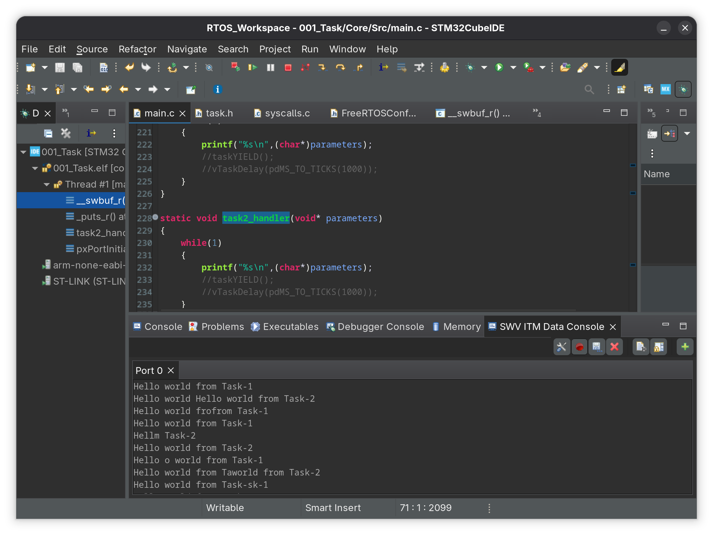
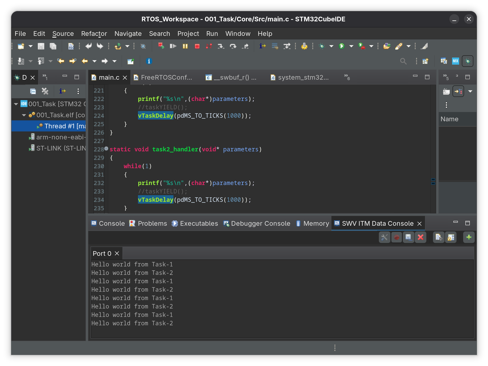
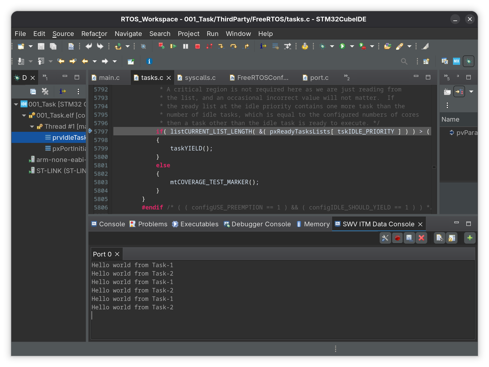

# 001_Task

Two FreeRTOS tasks printing to SWV ITM Data Console.

## Output

| Mode | Result |
|------|--------|
| Preemptive + time slicing |  |
| Preemptive + vTaskDelay |  |
| Cooperative + taskYIELD |  |
