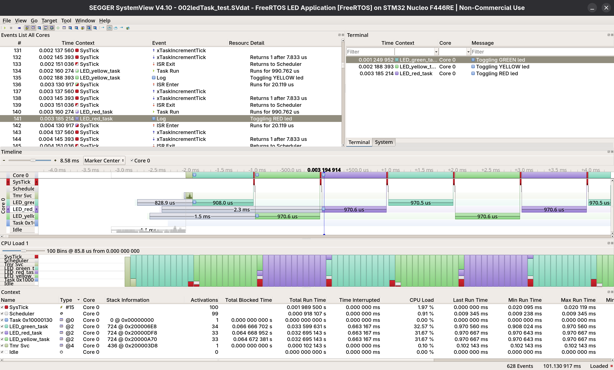
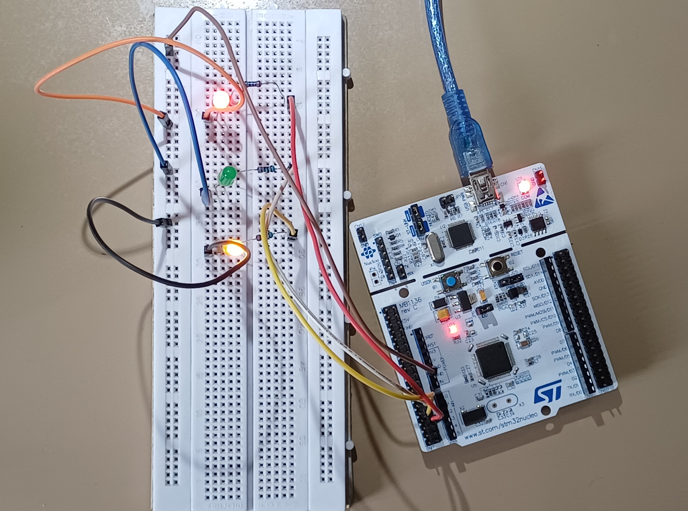

# 002_LedTasks

Three FreeRTOS tasks independently controlling three LEDs at different
toggle rates, verified with SEGGER SystemView RTT recording.

## Tasks

| Task | LED | GPIO | Toggle Rate | Priority |
|------|-----|------|-------------|----------|
| LED_green_task | Green | PA0 | 1000ms | 2 |
| LED_yellow_task | Yellow | PA1 | 800ms | 2 |
| LED_red_task | Red | PA4 | 400ms | 2 |

## Output

### SEGGER SystemView displaying Task Timeline

### Circuit

