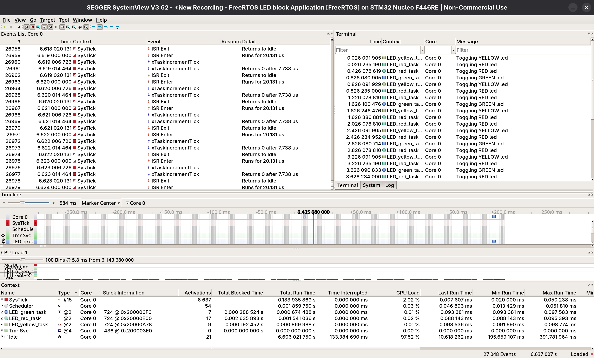

# 003_Led_Blocktasks

Three FreeRTOS tasks independently controlling three LEDs at different
toggle rates, verified with SEGGER SystemView RTT using UART based recording now. 
Also vTaskDelay is used instead of HAL delay function to achieve much less load on the CPU

## Tasks
- Same connects as before have been used
| Task | LED | GPIO | Toggle Rate | Priority |
|------|-----|------|-------------|----------|
| LED_green_task | Green | PA0 | 1000ms | 2 |
| LED_yellow_task | Yellow | PA1 | 800ms | 2 |
| LED_red_task | Red | PA4 | 400ms | 2 |

## Output

### SEGGER SystemView displaying Task Timeline (UART based)

