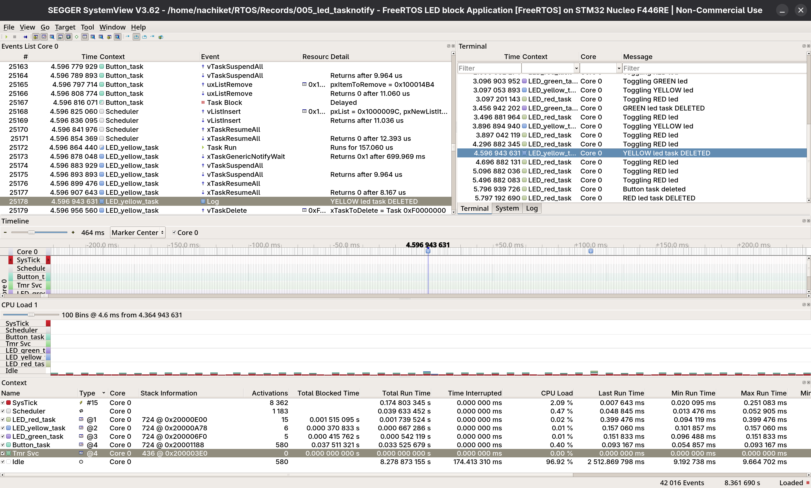

# 004_Led_PeriodicTasks

Three FreeRTOS tasks independently controlling three LEDs get deleted one by one at each
user button press and finally the last red led task deletes itself and the button task too
- Same connections as the earlier led project have been used
- xTaskNotify() is used to notify the respective task with each button press
## Tasks

| Task | LED | GPIO | Toggle Rate | Priority |
|------|-----|------|-------------|----------|
| LED_green_task | Green | PA0 | 1000ms | 3 |
| LED_yellow_task | Yellow | PA1 | 800ms | 2 |
| LED_red_task | Red | PA4 | 400ms | 1 |

## Output

### SEGGER SystemView displaying Task Timeline (UART based)

