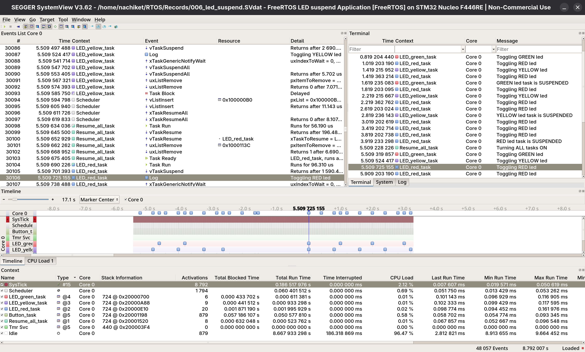

# 006_Led_TaskSuspend

Three FreeRTOS tasks independently controlling three LEDs get suspended one by one at each
user button press and finally when all led tasks are suspended and the button is pressed again all task resume
- Same connections as the earlier led project have been used
- xTaskNotify, vTaskSuspend and vTaskResume are used to notify, suspend and resume respective tasks

## Tasks

| Task | LED | GPIO | Toggle Rate | Priority |
|------|-----|------|-------------|----------|
| LED_green_task | Green | PA0 | 1000ms | 4 |
| LED_yellow_task | Yellow | PA1 | 800ms | 3 |
| LED_red_task | Red | PA4 | 400ms | 2 |
| button_handler_task | - | PC13 | - | 5 |
| resumeall_task | - | - | - | 1 |
## Output

### SEGGER SystemView displaying Task Timeline (UART based)

