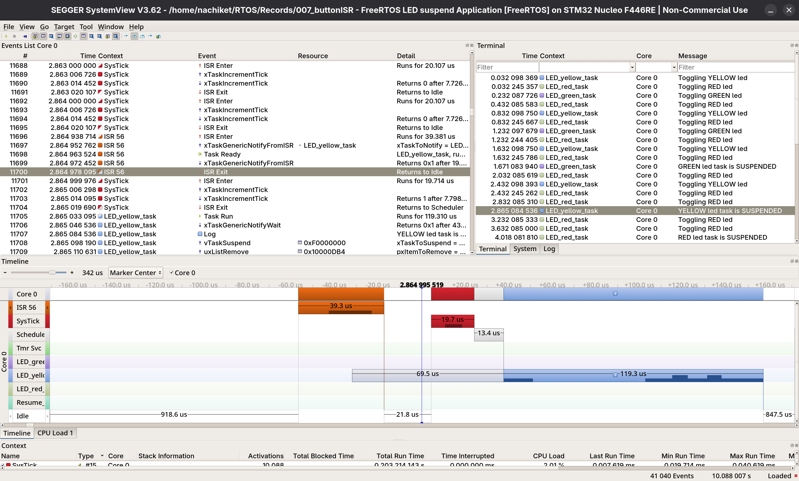
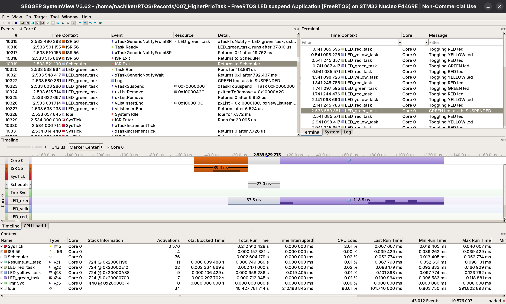

# 007_Led_ButtonISR

Three FreeRTOS tasks independently controlling three LEDs get suspended one by one at each
user button press and finally when all led tasks are suspended and the button is pressed again all task resume
- Instead of a task for button press detection enabling interrupts for user button on PC13 via the EXTI line [15:10]
- xTaskNotifyFromISR is used to notify tasks

## Tasks

| Task | LED | GPIO | Toggle Rate | Priority |
|------|-----|------|-------------|----------|
| LED_green_task | Green | PA0 | 1000ms | 4 |
| LED_yellow_task | Yellow | PA1 | 800ms | 3 |
| LED_red_task | Red | PA4 | 400ms | 2 |
| resumeall_task | - | - | - | 1 |

## Output
- Here pxHigherPriorityTaskWoken variable allows the ISR to run the higher priority task available to CPU directly
- Without this variable after ISR the execution returns to idle task which is of lower priority (not ideal)
### SEGGER SystemView displaying Task Timeline (UART based)
| Configuration | Output |
|---------------|--------|
| Without initializing pxHigherPriorityTaskWoken field in xTaskNotifyFromISR fucntion |  |
| Initializing pxHigherPriorityTaskWoken field in xTaskNotifyFromISR fucntion |  |

