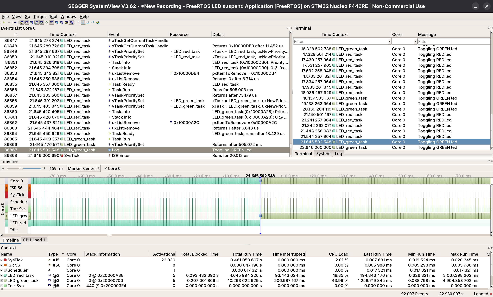

# 008_TaskPrio_Switch

Two FreeRTOS tasks independently controlling two LEDs switch their priorities with each other when button ISR runs 
leaving only one task running at a time
- uxTaskPriorityGet used to get priority of any task wrt task handle
- xTaskGetCurrentTaskHandle used to get handle of currently running task
- vTaskPrioritySet to switch the priority of tasks

## Tasks

| Task | LED | GPIO | Toggle Rate | Priority |
|------|-----|------|-------------|----------|
| LED_green_task | Green | PA0 | 1000ms | variable |
| LED_red_task | Red | PA4 | 400ms | variable |

## Output

### SEGGER SystemView displaying Task Timeline (UART based)
 

