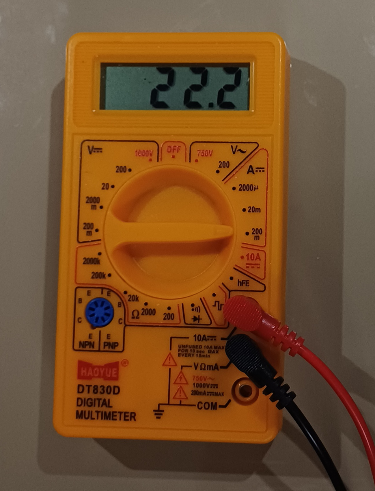
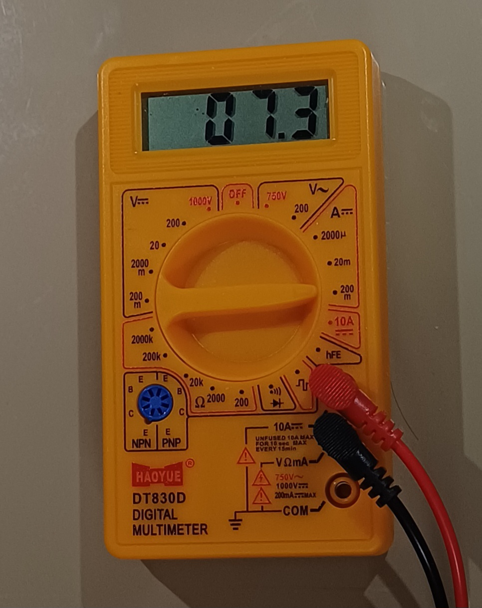

# 009_SleepWhen_Idle

Three FreeRTOS tasks independently controlling three LEDs at different
toggle rates
- When idle task runs the CPU goes to sleep in WFI mode
- When systick interrupt or any other interrupt is received the CPU wakes up
- vApplicationIdleHook is used to enable the sleep mode
- configUSE_IDLE_HOOK is configured to 1 in the freertosconfig.h to use the hook function

## Tasks

| Task | LED | GPIO | Toggle Rate | Priority |
|------|-----|------|-------------|----------|
| LED_green_task | Green | PA0 | 1000ms | 2 |
| LED_yellow_task | Yellow | PA1 | 800ms | 2 |
| LED_red_task | Red | PA4 | 400ms | 2 |

## Output

### Multimeter readings displaying current consumption
- Before sleep mode is enabled

- After sleep mode is enabled

