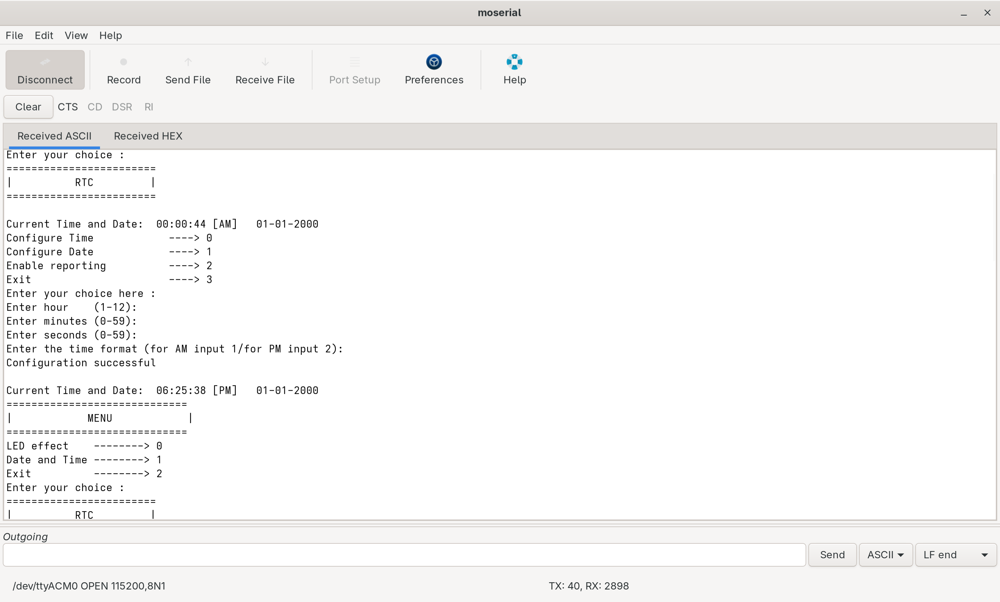
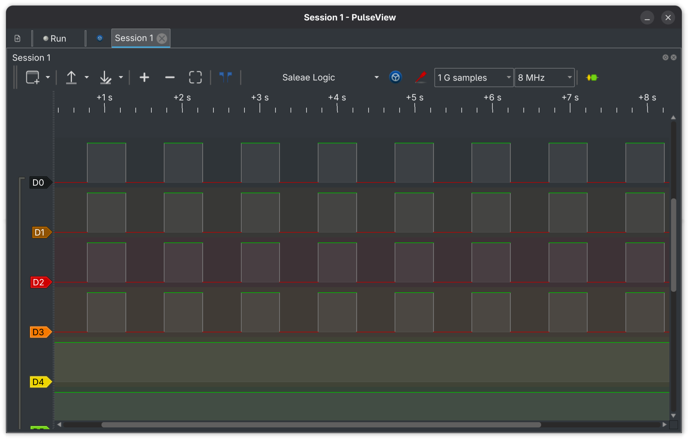
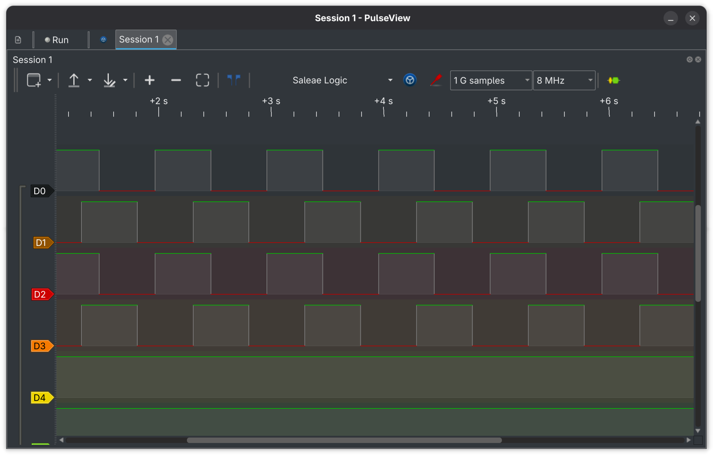
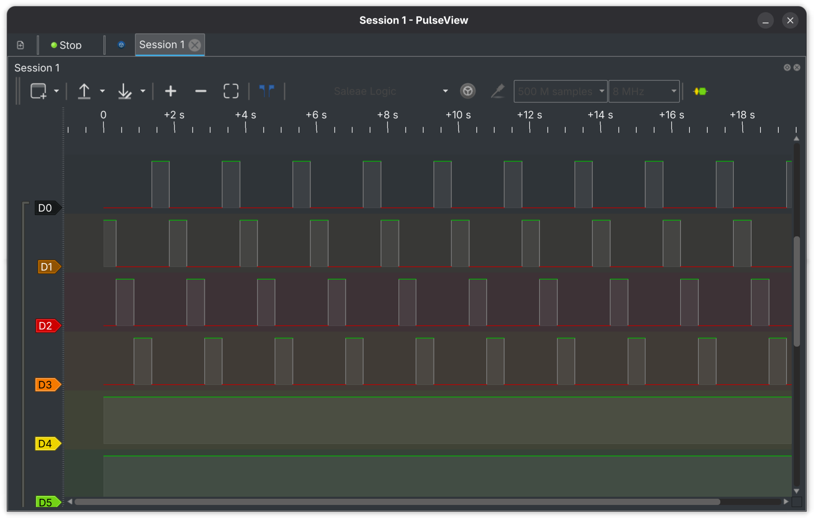
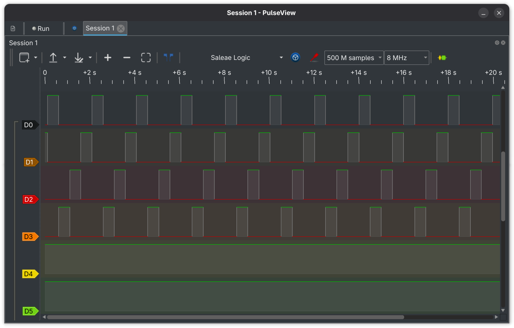

# 010_QueuesAnd_Timers
Software timers and queues used to build a UART-controlled menu system
for configuring LED effects and RTC time/date on STM32 via FreeRTOS. 

## Tasks

| Task                 | Operation                                              | Priority |
|----------------------|--------------------------------------------------------|----------|
| menu_task            | Displays main menu, routes user choice to led/rtc task | 2        |
| led_task             | Displays LED menu, runs selected LED effect            | 2        |
| command_handler_task | Waits for UART input, extracts command, notifies task  | 2        |
| rtc_task             | Handles RTC menu, configures time/date/reporting       | 2        |
| printf_task          | Receives from q_print queue, transmits over UART       | 2        |

## Queues
| Queue                 | Used for                                         | Items (Queue Length) | Item Size |
|-----------------------|--------------------------------------------------|----------------------|-----------|
| q_data | Used to route data from user to the respective task | 10 | sizeof(char) = 1 byte |
| q_print | Used to display menus, errors, output and confirmation messages from the application | 10 | sizeof(size_t) = 4 bytes |

## Output

### Time Configuration
- for detailed information check the log file in the folder

### Led Effects displayed via logic analyser
- e1 turns all leds ON and OFF periodically all at once
- e2 turns all even and odd leds ON and OFF periodically one by one
- e3 turns all leds ON and OFF in a row starting the first led to the last
- e4 is the same e3 effect but in reverse

| Led Effect | Logic analyser output |
|------------|----------------------|
| e1 |  |
| e2 |  |
| e3 |  |
| e4 |  |

