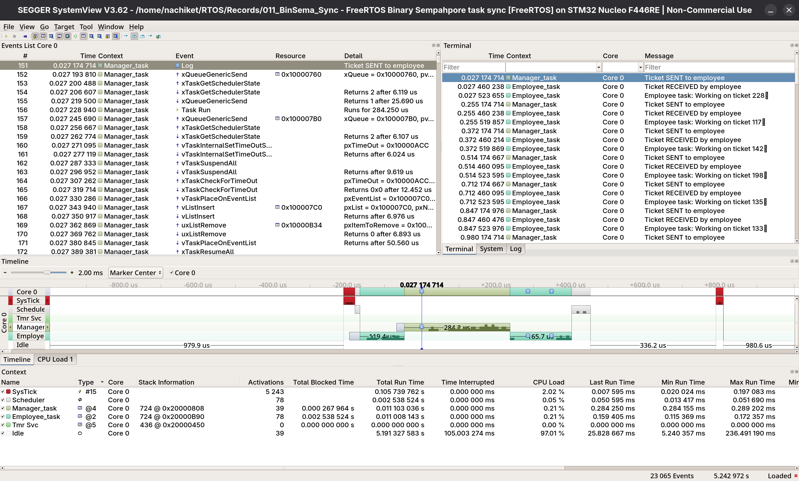

# 011_BinarySemaphore_TaskSync
The working of two tasks synchronised by using a binary semaphore
- Manager task sends data and releases semaphore
- Employee task can only dork when semaphore is released by the manager it remains in blocking state till semaphore released

## Tasks

| Task                 | Operation                                | Priority |
|----------------------|------------------------------------------|----------|
| Manager_task         | Sends data to employee and releases the semaphore | 4 |
| Employee_task        | Gets data from manager and processes it            | 2 |

## Output

### SEGGER SystemView displaying Task Timeline (UART based)

