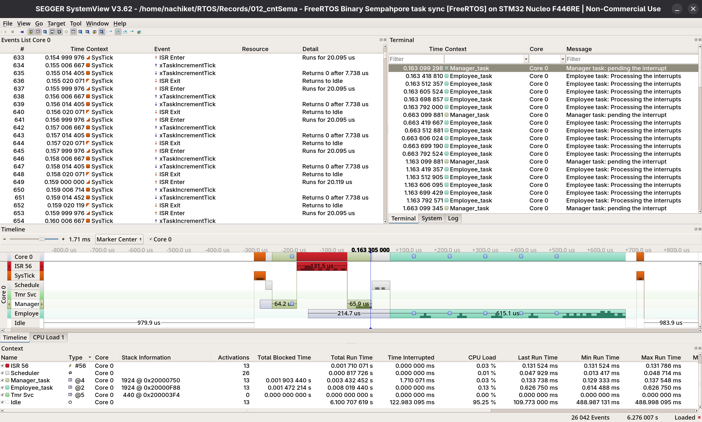

# 012_CntSemaphore
The working of two tasks synchronised by using a counting semaphore
- Manager task pends the interrupts and from the ISR the semaphore is given 5 times so count of semaphore is decreased by 5
- Employee task can only work when semaphore is given from the ISR with each semaphore it loops and prints till no semaphore is available for it and goes back into blocking state 

## Tasks

| Task                 | Operation                                | Priority |
|----------------------|------------------------------------------|----------|
| Manager_task         | Pends the interrupt 5 times | 4 |
| Employee_task        | Receives 5 semaphores from ISR and prints till zero are left | 2 |

## Output

### SEGGER SystemView displaying Task Timeline (UART based)

