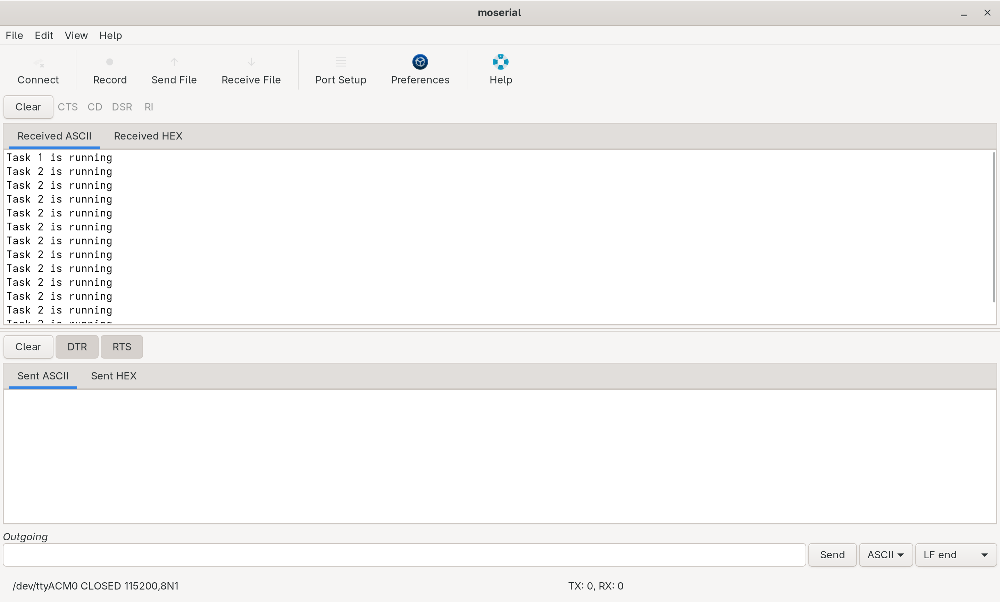

# 013_BinarySemaphore_Mutex
Two tasks are running 1st task takes binary semaphore and releases it but second does not 
- Task 1 runs and prints by accessing the usart peripheral
- Task 2 runs and prints by accessing the usart peripheral but doesn't release the semaphore thus task 1 goes into blocking state only task 2 runs

## Tasks

| Task                 | Operation                                | Priority |
|----------------------|------------------------------------------|----------|
| task 1         | Prints by taking and releasing semaphore | 2 |
| task 2        | Prints by taking and not releasing semaphore | 2 |

## Output
### Moserial terminal terminal displaying output from nucleo

