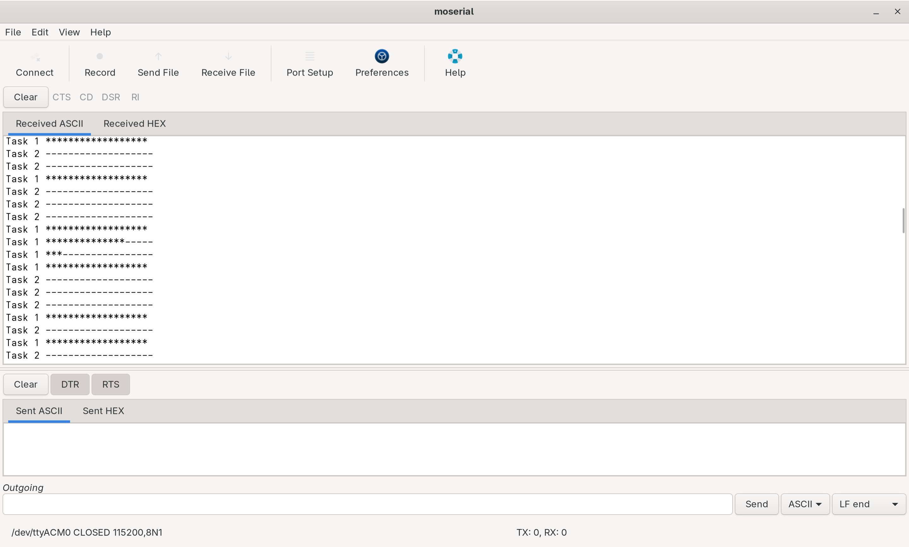
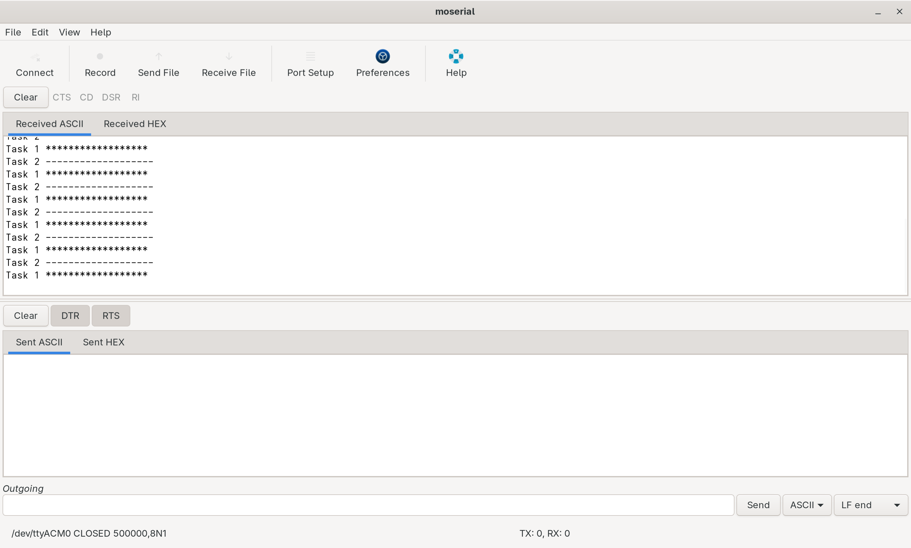

# 014_MutexAPI
Demonstrates mutual exclusion using FreeRTOS Mutex API. Two tasks compete 
for UART access without mutex both tasks corrupt each other's output, 
with mutex enabled each task gets exclusive UART access before printing.

## Tasks
| Task    | Operation                                    | Priority |
|---------|----------------------------------------------|----------|
| Print1  | Prints asterisk string, waits random delay   | 1        |
| Print2  | Prints dash string, waits random delay       | 2        |

## Output
### Moserial terminal displaying output from nucleo
| Mutex API | Moserial Output                              |
|-----------|----------------------------------------------|
| Disabled   |    |
| Enabled |     |

